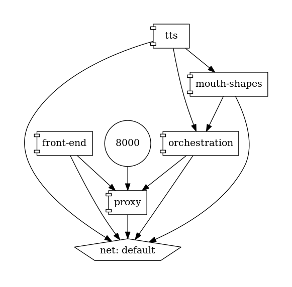

# reverse-proxy-docker-compose-express

`http-proxy-middlware` to serve a reverse proxy that routes to multiple `express` applications as containers via `docker-compose`

## Getting Started

Build images and run containers:

```bash
docker-compose build && docker-compose up
```

Then navigate to: <http://localhost:8000/front-end>

## Architecture of docker-compose-yml



## Regenerate docker-compose.png

```bash
docker run --rm -it --name dcv -v $(pwd):/input pmsipilot/docker-compose-viz render -m image docker-compose.yml
```

## Other diagrams can be recreated with

<https://mermaid-js.github.io/>