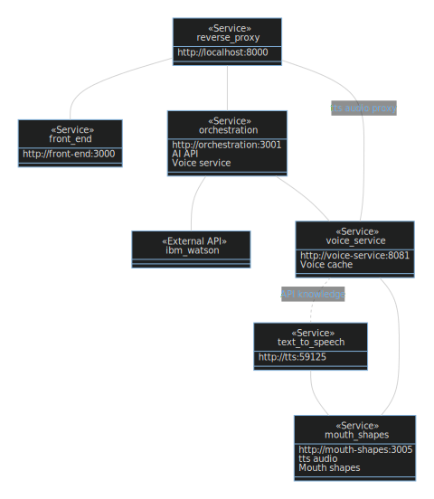

# Korerorero / Reverse Proxy

`http-proxy-middleware` to serve a reverse proxy that routes to multiple `express` applications as containers via `docker-compose`

## Getting Started

Build images and run containers:

```bash
docker-compose build && docker-compose up
```

Then navigate to: <http://localhost:8000/front-end>

## Sequence diagram of a call to make the voice and mouth shapes animate


## Class diagram of services



## Architecture of docker-compose-yml


## Postscript: diagrams in this README

### Regenerate docker-compose.png

```bash
docker run --rm -it --name dcv -v $(pwd):/input pmsipilot/docker-compose-viz render -m image docker-compose.yml
```

### Other diagrams can be recreated with

<https://mermaid-js.github.io/>

### Run in production

The docker-compose file assumes it's running in dev, and everything needs to be built.

To serve it up in a prod environment, run the following commands in the terminal.

They make all the images (except proxy) be pulled from Docker Hub, and, sets the start command to serve up a SSL version.

```bash
sed -i 's/build:/# build:/g' docker-compose.yml
sed -i 's/context: /# context: /g' docker-compose.yml
sed -i 's/    # context: \./  build:\n      context: \./g' docker-compose.yml

sed -i 's/# command/command/g' docker-compose.yml
sed -i 's/# privileged/privileged/g' docker-compose.yml
sed -i 's/ports:/ports:\n      - 80:80\n      - 443:443/g' docker-compose.yml
```

### Notes on Greenlock in docker

TL;DR: unless they certs are stored in a volume, they will be requested every time the container is brought up and the API limit will get hit pretty quick.

<https://git.rootprojects.org/root/greenlock-express.js/issues/58>

